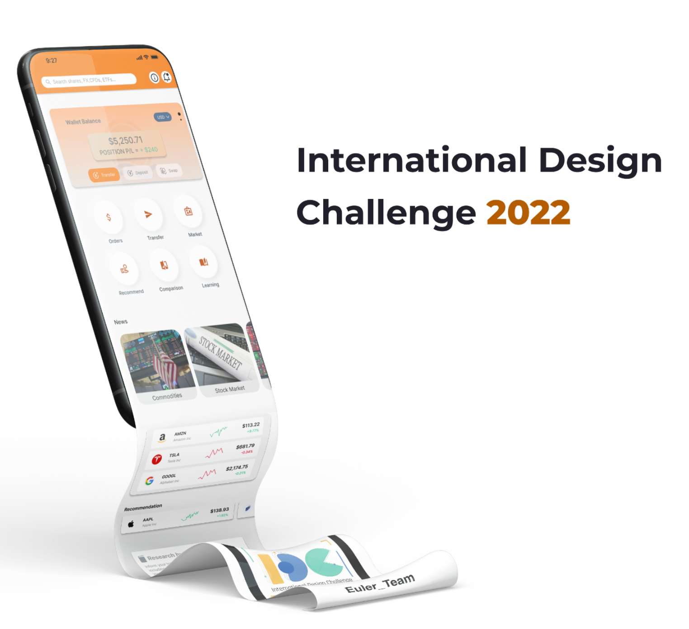
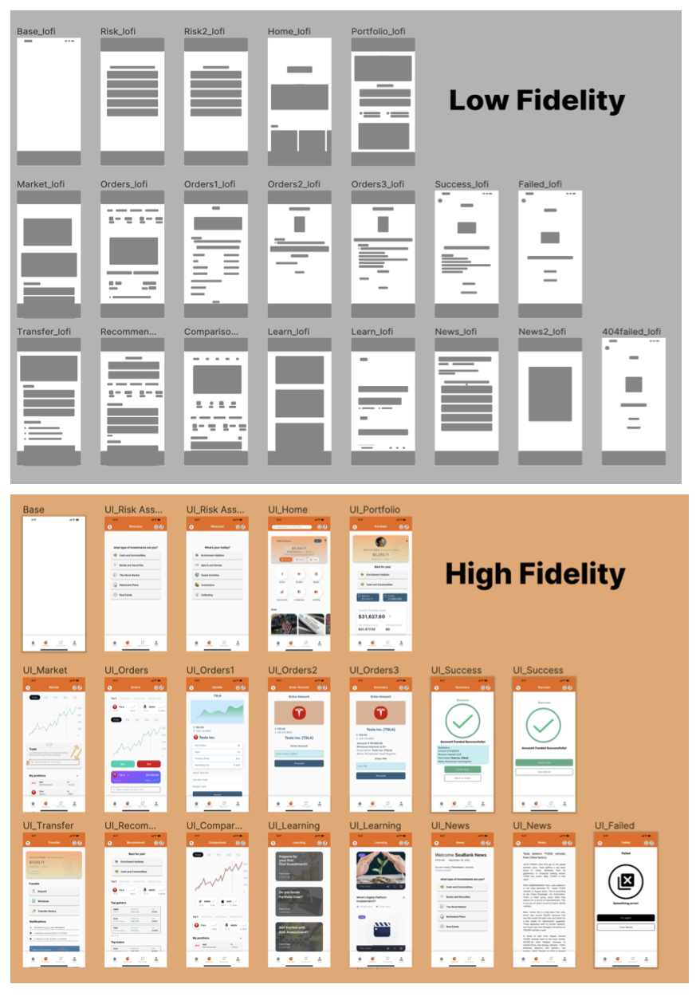

<!-- PROJECT LOGO -->
 

  

  <h3 align="center">Portfolio User Interface and User Experience for Seabank</h3>

<!-- TABLE OF CONTENTS -->

  
Table of Contents

  <ol>
    <li>
      <a href="#about-the-project">About The Project</a>
    <li><a href="#contact">Contact</a></li>
  </ol>

<!-- ABOUT THE PROJECT -->
## About The Project

This project focuses on creating a user-friendly interface for SeaBank Indonesia to enable users to manage their investments effectively. By leveraging the UX design process, the team addressed challenges such as users' limited knowledge of investments, diverse risk profiles, and difficulty navigating investment options. The project used quantitative and qualitative research to understand user needs and preferences, culminating in a design that simplifies investment decisions and educates users.

  
Keypoint:

[Download Portfolio](https://github.com/MuhammadYusufNugroho/User-Interface-User-Experience-at-Seabank-2022-/blob/main/IDC2022/IDC2022_Eular%20Team.pdf)

[Download Eular Responses](https://github.com/MuhammadYusufNugroho/User-Interface-User-Experience-at-Seabank-2022-/blob/main/IDC2022/Euler_Responses.xlsx)  

<!-- CONTACT -->
## Contact

Your Name - [@Muhammad Yusuf Nugroho](https://www.linkedin.com/in/muhammad-yusuf-nugroho-826b6a31b/)

Project Link: [https://github.com/MuhammadYusufNugroho/User-Interface-User-Experience-at-Seabank-2022-/](github.com/MuhammadYusufNugroho/User-Interface-User-Experience-at-Seabank-2022-/)

